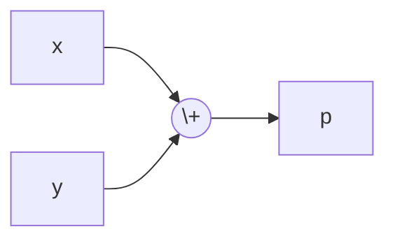
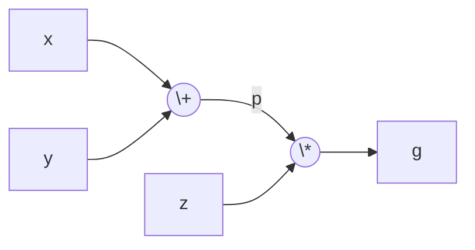
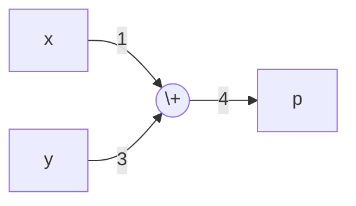
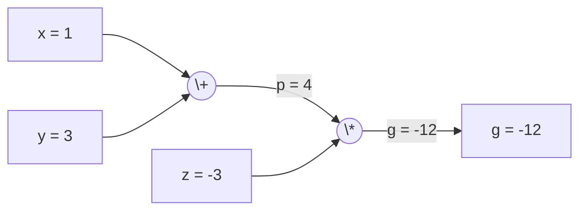
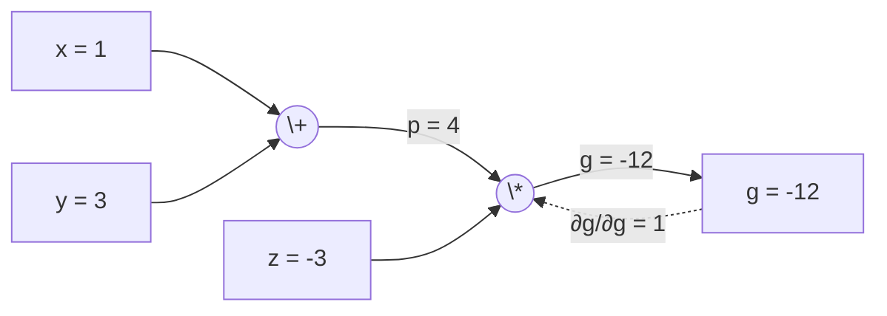

# 計算圖(Computation Graph)

# 計算圖

瀏覽人數：934最近更新：最近更新：2020年10月13日

反向傳播通過使用計算圖形在Tensorflow，Torch，Theano等深度學習框架中實現。 更爲重要的是，理解計算圖上的反向傳播結合了幾種不同的算法及其變體，如通過時間反向傳播和共享權重反向傳播。一切轉換成計算圖，它們仍然是相同的算法 - 只是在計算圖上反向傳播。

## 什麼是計算圖

計算圖被定義爲有向圖，其中節點對應於數學運算。 計算圖是表達和評估數學表達式的一種方式。

例如，這裏有一個簡單的數學公式 -

```shell
p = x + y
```

我們可以繪製上述方程的計算圖如下。



上面的計算圖具有一個加法節點(具有「+」符號的節點)，其具有兩個輸入變量`x`和`y`以及一個輸出`q`。

讓我們再舉一個例子，稍微複雜些。如下等式。

```shell
g = ( x + y ) ∗ z
```

以上等式由以下計算圖表示。



## 計算圖和反向傳播

計算圖和反向傳播都是深度學習訓練神經網絡的重要核心概念。

**前進傳遞**

正向傳遞是評估由計算圖表示的數學表達式的值的過程。 進行前向傳遞意味着我們將變量的值從左側(輸入)向前傳遞到輸出所在的右側。

讓我們考慮一個例子，給所有的投入賦予一些價值。 假設給所有輸入賦予下列值。

```shell
x=1, y=3, z=−3
```

通過將這些值賦予輸入，我們可以執行正向傳遞並獲得每個節點上輸出的以下值。

首先，使用`x = 1`和`y = 3`的值來獲得`p = 4`。



然後使用`p = 4`和`z = -3`來得到`g = -12`。下面從左到右前進。



## 後向傳遞目標

在後向傳遞中，我們的目的是計算每個輸入相對於最終輸出的梯度。 這些梯度對於使用梯度下降訓練神經網絡至關重要。

例如，我們希望以下漸變。所需的漸變

```math
\frac{\partial x}{\partial f},\frac{\partial y}{\partial f},\frac{\partial z}{\partial f}
```

**後退傳遞**

我們通過查找最終輸出相對於最終輸出(本身！)的導數來開始反向傳遞。 因此，這將導致身份推導，並且值等於一。

```math
\frac{\partial g}{\partial g} = 1
```

計算圖現在看起來如下所示




接下來，我們將通過「`*`」操作進行反向傳遞。將計算`p`和`z`處的梯度。 由於`g = p * z`，所以可以知道

```math
\frac{\partial g}{\partial p} = z \\
\frac{\partial g}{\partial z} = p
```

已經知道正向傳遞的`z`和`p`值。 因此得到

```math
\frac{\partial g}{\partial z} = p = 4 \\
\frac{\partial g}{\partial p} = z = -3
```

我們想要計算`x`和`y`處的梯度

```math
\frac{\partial g}{\partial x},\frac{\partial g}{\partial y}
```

然而，我們想要有效地做到這一點(儘管`x`和`g`在圖中只有兩跳，想象它們彼此之間真的很遠)。 要有效計算這些值，我們將使用差異化的鏈式規則。 從連鎖規則來看，如下

```math
\frac{\partial g}{\partial x}=
\frac{\partial g}{\partial p}
\cdot
\frac{\partial p}{\partial x} \\
\frac{\partial g}{\partial y}=
\frac{\partial g}{\partial p}
\cdot
\frac{\partial p}{\partial y} \\
```

但是已經知道`dg/dp = -3`，`dp/dx`和`dp/dy`很容易，因爲`p`直接取決於`x`和`y`。如下公式

```math
p = x + y→\frac{\partial p}{\partial x}=1,\frac{\partial p}{\partial y}=1
```

因此，可以得到

```math
\frac{\partial g}{\partial f}=
\frac{\partial g}{\partial p}
\cdot
\frac{\partial p}{\partial x}=
(-3)\cdot 1=-3
```

另外，對於輸入`y`

```math
\frac{\partial g}{\partial y}=
\frac{\partial g}{\partial p}
\cdot
\frac{\partial p}{\partial y}=
(-3)\cdot 1=-3
```

這樣做的主要原因是，當必須計算`x`處的梯度時，只使用了已計算的值，而`dq/dx`(節點輸出相對於同一節點的輸入的導數)。使用本地信息來計算全局值。

## 訓練神經網絡的步驟

按照這些步驟來訓練一個神經網絡

- 對於數據集中的數據點`x`，使用`x`作爲輸入進行前向傳遞，並計算成本`c`作爲輸出。
- 從`c`開始向後傳遞，併爲圖中的所有節點計算漸變。 這包括表示神經網絡權重的節點。
- 然後通過 W = W - 學習率*梯度來更新權重。
- 重複這個過程，直到滿足停止條件。